# Multi-Model Position Trading Pipeline — Architecture Document

**Version:** 1.1  
**Date:** April 2026  
**Status:** Design Phase  
**Changelog:** v1.1 — Replaced pure clustering with hybrid approach (cluster baseline + individual promotion). Corrected yfinance data availability (daily bars support `period="max"`, 20+ years). Added PromotionGate class and demotion rules.

---

## 1. Executive Summary

This document describes the architecture for a Python-based, multi-model algorithmic trading system designed for **position trading** (holding periods of days to weeks). The system uses a three-layer cascade pipeline that combines classical quantitative analysis with AI/ML meta-labeling and LLM-based sentiment validation to generate stock-specific entry and exit signals.

The core design principles are:

- **Per-stock tunability** — every stock has unique behavior; the system adapts parameters and model weights per instrument through regime detection and stock clustering.
- **Cascade over ensemble** — the classical quant layer predicts trade direction (high recall), the ML meta-model decides whether to act (precision filter), and the LLM layer provides final validation only for actionable signals.
- **Cost efficiency** — FinBERT runs locally at zero cost for all tickers; expensive GPT/Perplexity API calls are reserved only for stocks that produce actionable signals.
- **Anti-overfitting by design** — walk-forward optimization, purged cross-validation, and Bayesian hyperparameter tuning prevent curve-fitting.

---

## 2. System Architecture Overview

### 2.1 High-Level Pipeline Flow

```
┌─────────────────────────────────────────────────────────────────────┐
│                        DATA INGESTION LAYER                         │
│  Market Data (OHLCV) │ News Headlines │ Earnings │ Macro Events     │
└──────────┬──────────────────┬────────────────────┬──────────────────┘
           │                  │                    │
           ▼                  ▼                    │
┌──────────────────┐  ┌───────────────────┐        │
│  Technical       │  │  FinBERT Batch    │        │
│  Indicator Calc  │  │  Sentiment Scorer │        │
│  (pandas-ta)     │  │  (Local, Free)    │        │
└────────┬─────────┘  └────────┬──────────┘        │
         │                     │                    │
         ▼                     ▼                    │
┌─────────────────────────────────────────┐        │
│     LAYER 1: REGIME DETECTION           │        │
│     HMM + ADX → {trending, ranging,     │        │
│                   volatile}              │        │
└─────────────────┬───────────────────────┘        │
                  │                                 │
                  ▼                                 │
┌─────────────────────────────────────────┐        │
│     LAYER 2: CLASSICAL QUANT ENGINE     │        │
│     Regime-weighted composite signal    │        │
│     Per-stock tuned parameters          │        │
│     Output: direction + confidence      │        │
└─────────────────┬───────────────────────┘        │
                  │                                 │
                  ▼                                 │
┌─────────────────────────────────────────┐        │
│     LAYER 3: ML META-LABELING           │        │
│     XGBoost/LightGBM meta-model         │        │
│     Input: quant features + sentiment   │        │
│     Output: trade/no-trade + bet size   │        │
└─────────────────┬───────────────────────┘        │
                  │ (only if trade = yes)            │
                  ▼                                  ▼
┌──────────────────────────────────────────────────────┐
│     LAYER 4: LLM DEEP VALIDATION (GPT / Perplexity) │
│     Earnings context, macro risk, news that could    │
│     invalidate the technical signal                  │
│     Output: APPROVE / VETO + reasoning               │
└─────────────────┬────────────────────────────────────┘
                  │
                  ▼
┌─────────────────────────────────────────┐
│     RISK MANAGEMENT & EXECUTION         │
│     Position sizing (Kelly / ATR)       │
│     Stop-loss / take-profit placement   │
│     Human review gate (optional)        │
└─────────────────────────────────────────┘
```

### 2.2 PlantUML — Component Diagram

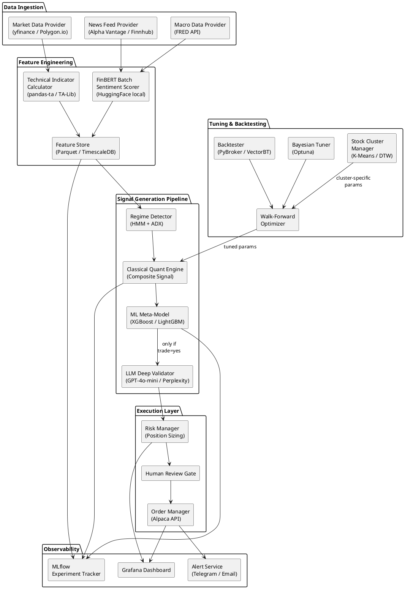

---

## 3. Data Layer

### 3.1 Data Sources

| Data Type | Source | Frequency | History Available | Storage |
|-----------|--------|-----------|-------------------|---------|
| OHLCV (Daily) | yfinance (free) / Polygon.io (paid) | End of day | yfinance: `period="max"` → 20+ years for established equities. No practical limit on daily bars. Use explicit `start`/`end` dates for precise control. | Parquet files |
| OHLCV (Intraday) | Polygon.io / Alpaca | 1-hour bars | yfinance: sub-daily limited to 60 days, 1-min limited to 7 days. Use paid providers for longer intraday history. | TimescaleDB |
| News Headlines | Alpha Vantage NEWS_SENTIMENT / Finnhub | Hourly batch | Varies by provider | SQLite / Postgres |
| Earnings Calendar | Alpha Vantage / Finnhub | Daily | N/A | Parquet |
| Macro Indicators | FRED API (free) | Weekly | Decades | Parquet |
| Fundamentals | Alpha Vantage / OpenBB | Quarterly | 5–10 years typical | Parquet |

**Note on yfinance for production:** yfinance is an unofficial scraper — it works well for research and prototyping but carries risk of rate-limiting, IP blocking, and breakage from Yahoo site changes. For live trading with real capital, migrate to a paid provider (Polygon.io, Alpaca, Finnhub, or FMP) that offers SLA guarantees and dedicated support.

### 3.2 Feature Store Schema

```python
# features/{ticker}/daily.parquet
columns = {
    # Price-based
    "open", "high", "low", "close", "volume", "adj_close",
    
    # Technical indicators (computed by pandas-ta)
    "sma_10", "sma_30", "sma_50", "sma_200",
    "ema_10", "ema_30",
    "rsi_14",
    "macd", "macd_signal", "macd_histogram",
    "bbands_upper", "bbands_mid", "bbands_lower", "bbands_width", "bbands_pctb",
    "atr_14",
    "adx_14", "di_plus", "di_minus",
    "obv", "obv_momentum",
    "donchian_upper_30", "donchian_lower_30",
    
    # Derived features
    "log_return_1d", "log_return_5d", "log_return_20d",
    "volatility_5d", "volatility_20d",
    "volume_ratio",  # current / 20-day SMA
    "close_vs_sma20",  # (close - sma20) / sma20
    "dist_from_52w_high",
    "rolling_skew_20d", "rolling_kurt_20d",
    
    # Sentiment (from FinBERT batch)
    "sentiment_score",     # P(positive) - P(negative)
    "sentiment_confidence", # max(P(pos), P(neg), P(neutral))
    "sentiment_ma_5d",     # 5-day rolling average
    "sentiment_ma_20d",    # 20-day rolling average
    "sentiment_momentum",  # 5d_avg - 20d_avg
    "news_volume_ratio",   # articles today / 20-day avg
    
    # Regime label (from HMM)
    "regime",  # {0: trending_up, 1: trending_down, 2: ranging, 3: volatile}
    
    # Meta
    "timestamp",
}
```

---

## 4. Layer-by-Layer Design

### 4.1 FinBERT Sentiment Batch Processor

**Purpose:** Runs as a scheduled batch job, processes all news headlines for watchlist tickers, and stores sentiment scores in the feature store. Runs on CPU at zero cost.

**Hardware Requirements:**
- Model size: ~440 MB on disk, ~420 MB RAM (FP32) or ~210 MB (FP16)
- CPU-only: 8-core desktop processes ~1,500 headlines in ~60 seconds
- GPU (optional): Any GPU with 1+ GB VRAM makes it near-instant
- Minimum system: 8 GB RAM, any modern quad-core CPU

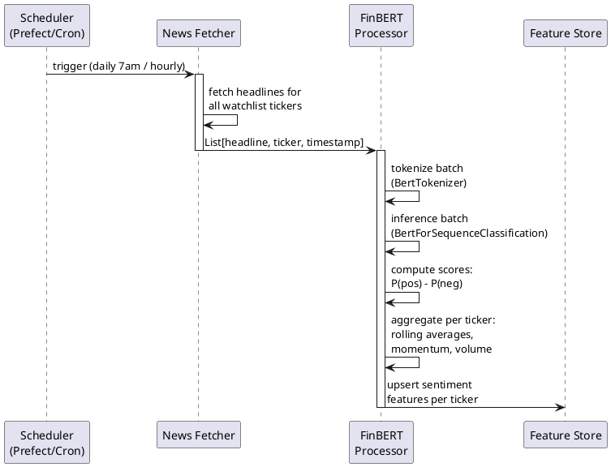

### 4.2 Regime Detection Module

**Purpose:** Classifies each stock's current market regime to determine which indicator weights and strategy parameters to apply. Uses a dual approach — ADX for fast classification and HMM for probabilistic regime estimation.

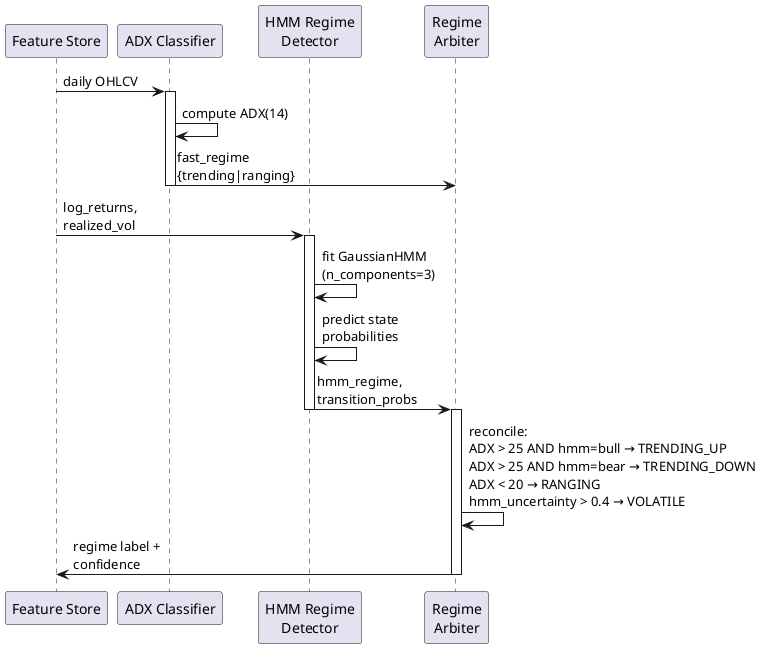

**Regime States and Strategy Implications:**

| Regime | ADX Signal | HMM State | Quant Strategy | Indicator Weights |
|--------|-----------|-----------|----------------|-------------------|
| TRENDING_UP | ADX > 25 | Bull state | Trend-following | MA: 0.35, MACD: 0.30, RSI: 0.15, BB: 0.10, Vol: 0.10 |
| TRENDING_DOWN | ADX > 25 | Bear state | Trend-following (short) | MA: 0.35, MACD: 0.30, RSI: 0.15, BB: 0.10, Vol: 0.10 |
| RANGING | ADX < 20 | Sideways state | Mean reversion | MA: 0.15, MACD: 0.15, RSI: 0.30, BB: 0.30, Vol: 0.10 |
| VOLATILE | Any | High uncertainty | Reduced exposure | MA: 0.20, MACD: 0.20, RSI: 0.20, BB: 0.20, Vol: 0.20 |

### 4.3 Classical Quant Engine (Layer 2 — Primary Signal Generator)

**Purpose:** Generates entry/exit direction signals with a composite confidence score. Each indicator is normalized to [-1, +1] and combined using regime-dependent weights. Parameters are sourced from the hybrid tuning store: individual overrides for promoted stocks, cluster defaults for all others.

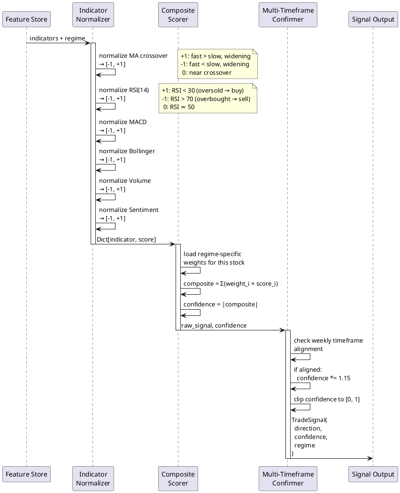

**Tunable Parameters Per Stock (via Optuna):**

| Parameter | Search Space | Description |
|-----------|-------------|-------------|
| `fast_ma_period` | [5, 50] | Fast moving average lookback |
| `slow_ma_period` | [20, 200] | Slow moving average lookback |
| `rsi_period` | [7, 21] | RSI calculation period |
| `rsi_oversold` | [20, 40] | RSI buy threshold |
| `rsi_overbought` | [60, 80] | RSI sell threshold |
| `bb_period` | [10, 30] | Bollinger Band lookback |
| `bb_std` | [1.5, 3.0] | Bollinger Band std deviation |
| `donchian_period` | [20, 55] | Donchian channel lookback |
| `atr_multiplier` | [1.5, 3.0] | Stop-loss distance (× ATR) |
| `sentiment_weight` | [0.0, 0.20] | FinBERT score weight in composite |
| `weekly_confirm_boost` | [1.0, 1.3] | Multi-timeframe confidence boost |

### 4.4 ML Meta-Labeling Model (Layer 3 — Precision Filter)

**Purpose:** Does NOT predict trade direction. Receives the quant engine's directional signal and decides (a) whether to act on it (trade / no-trade) and (b) how much to bet (position sizing). This is López de Prado's meta-labeling framework — the quant layer provides high recall, the ML layer improves precision by filtering false positives.

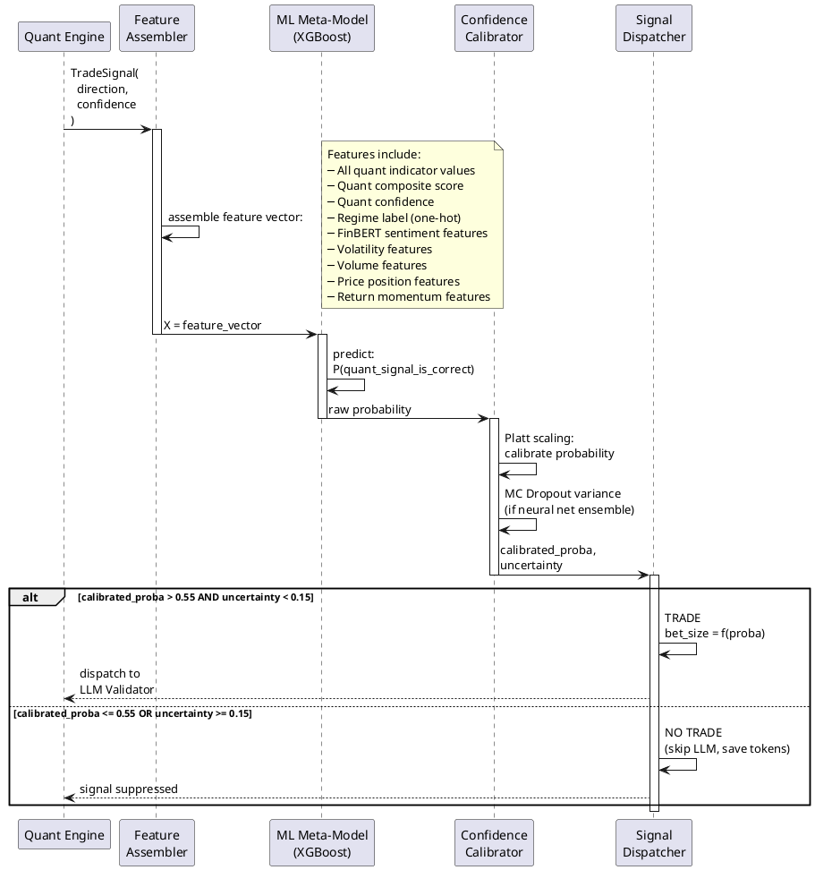

**Meta-Labeling Training Pipeline:**

| Step | Description |
|------|-------------|
| 1. Generate quant signals | Run quant engine on historical data with tuned params |
| 2. Apply triple-barrier labels | For each signal: TP barrier, SL barrier, time expiry → label as {1: correct, 0: false positive} |
| 3. Build meta-features | Quant features + quant predictions + sentiment + regime (a superset of quant input features) |
| 4. Train meta-model | XGBoost with purged k-fold CV, optimized for F1-score |
| 5. Calibrate | Apply Platt scaling to output probabilities |
| 6. Walk-forward validate | Retrain monthly on rolling 252-day windows |

### 4.5 LLM Deep Validator (Layer 4 — Final Gate)

**Purpose:** Called ONLY when Layers 2+3 produce an actionable signal. Provides qualitative validation by analyzing recent news, earnings context, and macro risks that might invalidate the technical/quantitative signal. Acts as a final veto gate.

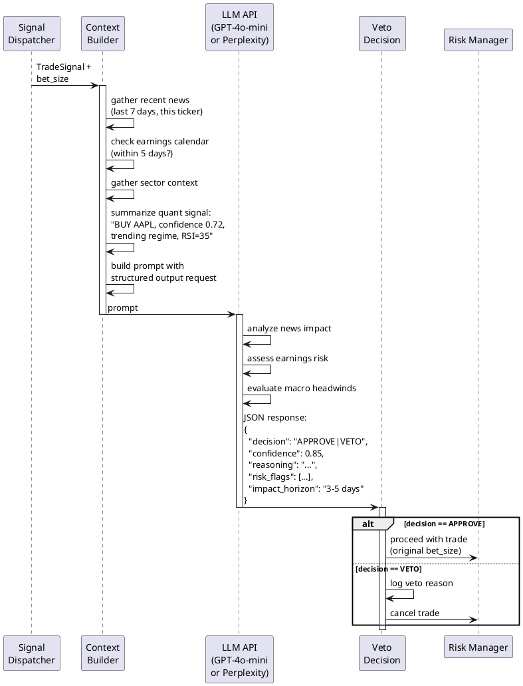

**Cost Control Mechanisms:**
- FinBERT batch covers ALL tickers daily → zero API cost
- GPT/Perplexity called only for ~5-15% of tickers that generate signals
- Use GPT-4o-mini (~$0.15/1M input tokens) rather than GPT-4o
- Cache LLM responses per ticker per day (same signal = same context)
- Estimated daily cost for 100-stock watchlist: $0.10–$0.50

---

## 5. Hybrid Per-Stock Tuning Architecture

### 5.1 Design Rationale: Cluster Baseline + Individual Promotion

Each stock's behavior is unique — that is a core design premise of this system. However, per-stock parameter optimization carries significant overfitting risk when historical data is limited. Research on 240 Russell 3000 stocks confirms that models trained on behaviorally clustered data outperform both universal models and models trained on the full stock universe (ScienceDirect, 2023). At the same time, stocks with deep history (10+ years, 2,500+ daily bars) can support individual tuning if validated rigorously.

The system therefore uses a **hybrid approach**:

1. **Cluster-based tuning as the safe baseline.** All stocks begin with parameters optimized across their behavioral cluster, giving each parameter set 5–10× more training data than individual tuning would.
2. **Per-stock promotion when statistically justified.** Stocks that meet strict criteria — sufficient history, significant OOS improvement over cluster defaults, parameter stability, and low probability of backtest overfitting — are promoted to their own individually tuned parameter set.
3. **Automatic demotion on degradation.** If a promoted stock's individual parameters underperform the cluster baseline in live/paper trading for 2 consecutive months, it reverts to cluster defaults.

**Data availability note:** yfinance supports `period="max"` which returns the full available history (often 20+ years for established US equities). It also supports explicit `start`/`end` date parameters with a default lookback of 99 years. The 5-year limit only applies to the `period="5y"` shortcut. Intraday data is limited (1-minute bars: 7 days; sub-daily bars: 60 days max), but daily bars — which this system uses — have no practical limit. For production, consider migrating to Polygon.io or Alpaca data feeds to avoid yfinance's rate-limiting and scraping fragility.

### 5.2 Stock Clustering (Baseline Parameters)

Stocks are grouped by behavioral similarity using statistical features extracted from their price history. Each cluster shares an optimized parameter set — this is the default for all stocks.

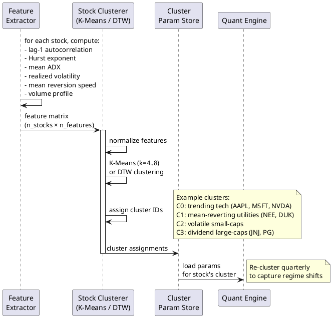

### 5.3 Walk-Forward Optimization (Runs at Both Levels)

The same WFO process runs for cluster-level tuning (pooled data from all cluster members) and for individual stock candidates (single stock data). The key difference is the data volume feeding each optimization.

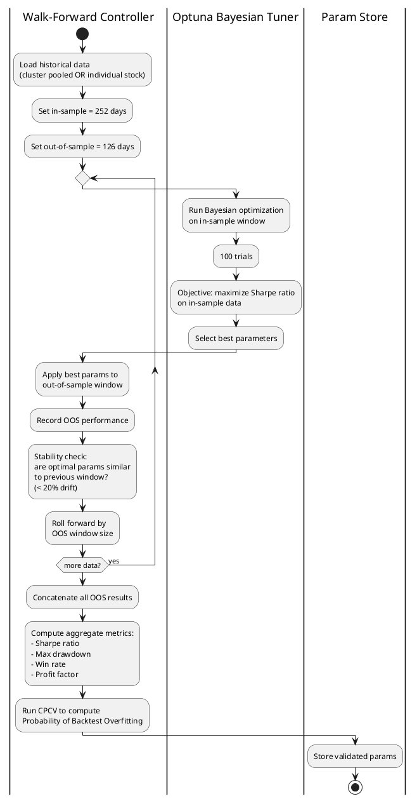

### 5.4 Individual Promotion Decision Gate

After both cluster-level and individual-level WFO complete, the system decides which parameter set each stock should use. This runs monthly as part of the automated tuning cycle.

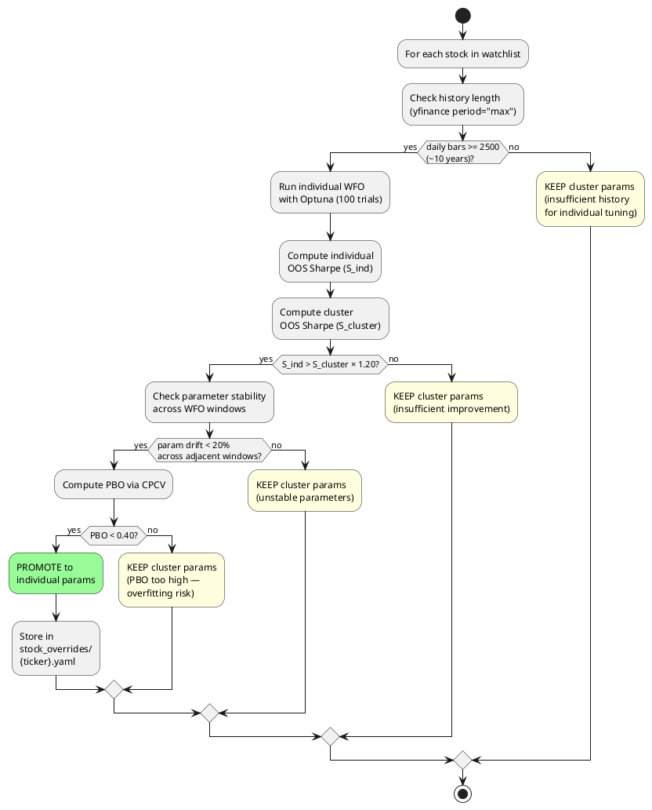

**Promotion Criteria Summary:**

| Criterion | Threshold | Rationale |
|-----------|-----------|-----------|
| Minimum history | ≥ 2,500 daily bars (~10 years) | Sufficient data to support 10-12 parameter optimization without severe overfitting |
| OOS Sharpe improvement | Individual > Cluster × 1.20 | Must be meaningfully better, not marginally — marginal gains are likely noise |
| Parameter stability | < 20% drift between adjacent WFO windows | Unstable optimal parameters indicate the "optimum" is noise, not signal |
| Probability of Backtest Overfitting | PBO < 0.40 | López de Prado's threshold — if PBO ≥ 0.50, the strategy is more likely to fail live than succeed |
| Minimum OOS trades | ≥ 30 trades per OOS window | Statistical significance requires sufficient sample size |

**Demotion Rule:** If a promoted stock's rolling 60-day live/paper Sharpe drops below the cluster baseline Sharpe by more than 0.3 for two consecutive months, it automatically reverts to cluster parameters. The demotion is logged and the stock is flagged for review.

**Expected distribution:** In a typical 100-stock watchlist, approximately 20–30% of stocks (primarily liquid large-caps with 15+ years of history like AAPL, MSFT, JNJ, JPM) will qualify for individual parameters. The remaining 70–80% will use cluster defaults — which is the safer, statistically robust choice for stocks with shorter or more volatile histories.

### 5.5 Parameter Store Directory Structure

```
config/
├── cluster_params/              # Cluster-level defaults (baseline for all stocks)
│   ├── cluster_0.yaml           # e.g., trending tech stocks
│   ├── cluster_1.yaml           # e.g., mean-reverting utilities
│   ├── cluster_2.yaml
│   └── ...
├── stock_overrides/             # Individual overrides (promoted stocks only)
│   ├── AAPL.yaml                # Promoted — uses individual params
│   ├── MSFT.yaml                # Promoted — uses individual params
│   └── ...
├── cluster_assignments.yaml     # {ticker: cluster_id} mapping
└── promotion_log.yaml           # Audit trail: promotions, demotions, reasons
```

The `QuantEngine` loads parameters with this priority: `stock_overrides/{ticker}.yaml` → `cluster_params/cluster_{id}.yaml`. If an individual override file exists for the ticker, it takes precedence; otherwise the cluster default applies.

### 5.6 Operational Schedule

| Frequency | Process | Automated? | Human Review? |
|-----------|---------|------------|---------------|
| Daily | Full pipeline (data → signals → trades) | Yes | Optional (check alerts) |
| Weekly | FinBERT health check, drift monitoring | Yes | Glance at dashboard |
| Monthly | WFO re-optimization (cluster + individual), meta-model retraining, promotion gate evaluation | Yes (scheduled) | Yes — review PBO, stability, OOS metrics before deploying new params |
| Quarterly | Stock re-clustering, re-evaluation of cluster count (k) | Yes (scheduled) | Yes — review cluster composition, sanity check groupings |
| On demotion trigger | Automatic revert to cluster params | Yes | Review flagged — investigate why individual params degraded |
| Ad-hoc | Add/remove tickers from watchlist | Manual | — |

---

## 6. Class Diagram

```plantuml
@startuml
skinparam backgroundColor white
skinparam classAttributeIconSize 0

package "Core Data Models" {
    class TradeSignal {
        +ticker: str
        +timestamp: datetime
        +direction: float  // -1.0 to +1.0
        +confidence: float // 0.0 to 1.0
        +source_layer: str
        +regime: RegimeType
        +features: Dict[str, float]
        +stop_loss_pct: float
        +take_profit_pct: float
        +bet_size: float
        +llm_approved: Optional[bool]
    }

    enum RegimeType {
        TRENDING_UP
        TRENDING_DOWN
        RANGING
        VOLATILE
    }

    class StockProfile {
        +ticker: str
        +cluster_id: int
        +tuned_params: Dict[str, Any]
        +regime_history: List[RegimeType]
        +last_tuned: datetime
    }

    class FeatureVector {
        +ticker: str
        +timestamp: datetime
        +technical: Dict[str, float]
        +sentiment: Dict[str, float]
        +derived: Dict[str, float]
        +regime: RegimeType
        +to_array(): np.ndarray
    }
}

package "Data Layer" {
    class MarketDataProvider {
        -api_key: str
        -cache_dir: Path
        +fetch_ohlcv(ticker, start, end): pd.DataFrame
        +fetch_realtime(ticker): Dict
        +get_earnings_calendar(ticker): List[date]
    }

    class NewsDataProvider {
        -api_key: str
        +fetch_headlines(ticker, days_back): List[Dict]
        +fetch_macro_news(days_back): List[Dict]
    }

    class FeatureStore {
        -storage_path: Path
        -db_connection: Optional[Connection]
        +save_features(ticker, df): void
        +load_features(ticker, start, end): pd.DataFrame
        +update_sentiment(ticker, scores): void
        +get_latest(ticker): FeatureVector
    }
}

package "Sentiment Layer" {
    class FinBERTProcessor {
        -model: BertForSequenceClassification
        -tokenizer: BertTokenizer
        -device: str  // "cpu" or "cuda"
        -batch_size: int
        +__init__(device="cpu")
        +analyze_batch(headlines: List[str]): List[SentimentResult]
        +compute_ticker_score(results): float
        +compute_rolling_features(scores, windows): Dict
    }

    class SentimentResult {
        +headline: str
        +positive: float
        +negative: float
        +neutral: float
        +score: float  // P(pos) - P(neg)
        +confidence: float
    }

    class LLMValidator {
        -api_client: OpenAI | Anthropic
        -model_name: str
        -max_tokens: int
        -cache: Dict[str, LLMResponse]
        +validate_signal(signal: TradeSignal, news: List, earnings: Dict): LLMResponse
        -_build_prompt(signal, context): str
        -_parse_response(raw): LLMResponse
    }

    class LLMResponse {
        +decision: str  // "APPROVE" | "VETO"
        +confidence: float
        +reasoning: str
        +risk_flags: List[str]
        +impact_horizon: str
    }
}

package "Signal Generation" {
    class RegimeDetector {
        -hmm_model: GaussianHMM
        -n_regimes: int
        -adx_threshold_trend: float
        -adx_threshold_range: float
        +fit(returns, volatility): void
        +detect(features: FeatureVector): RegimeType
        +get_transition_matrix(): np.ndarray
    }

    class QuantEngine {
        -indicator_weights: Dict[RegimeType, Dict[str, float]]
        -tuned_params: Dict[str, Any]
        +set_params(params: Dict): void
        +compute_indicators(df: pd.DataFrame): Dict[str, pd.Series]
        +normalize_signal(indicator, values): pd.Series
        +composite_score(features, regime): float
        +generate_signal(features: FeatureVector): TradeSignal
        -_ma_crossover_signal(df): float
        -_rsi_signal(df): float
        -_macd_signal(df): float
        -_bollinger_signal(df): float
        -_volume_signal(df): float
        -_multi_timeframe_confirm(daily, weekly): float
    }

    class MetaLabelModel {
        -model: XGBClassifier | LGBMClassifier
        -calibrator: CalibratedClassifierCV
        -feature_columns: List[str]
        -confidence_threshold: float
        -uncertainty_threshold: float
        +train(X, y_meta_labels): void
        +predict(features: FeatureVector, quant_signal: TradeSignal): MetaDecision
        +calibrate(X_val, y_val): void
        +get_feature_importance(): Dict[str, float]
    }

    class MetaDecision {
        +should_trade: bool
        +calibrated_proba: float
        +uncertainty: float
        +bet_size_fraction: float
    }
}

package "Tuning & Backtesting" {
    class StockClusterer {
        -n_clusters: int
        -features_to_use: List[str]
        -model: KMeans | TimeSeriesKMeans
        +fit(stock_profiles: List[StockProfile]): void
        +assign_cluster(ticker): int
        +get_cluster_members(cluster_id): List[str]
        +recluster(): void  // quarterly
    }

    class PromotionGate {
        -min_history_bars: int  // 2500
        -sharpe_improvement_threshold: float  // 1.20
        -param_drift_threshold: float  // 0.20
        -pbo_threshold: float  // 0.40
        -min_oos_trades: int  // 30
        -demotion_lookback_days: int  // 60
        +evaluate(ticker, cluster_wfo, individual_wfo): PromotionDecision
        +check_demotion(ticker, live_performance, cluster_baseline): bool
        +get_active_overrides(): List[str]
        +log_decision(ticker, decision, reasoning): void
    }

    enum PromotionDecision {
        PROMOTE
        KEEP_CLUSTER
        DEMOTE
    }

    class WalkForwardOptimizer {
        -in_sample_days: int  // 252
        -out_of_sample_days: int  // 126
        -n_trials: int  // 100
        -objective_metric: str  // "sharpe_ratio"
        +optimize_cluster(cluster_id, data): OptimizationResult
        +run_single_fold(params, train_data, test_data): float
        +stability_check(param_history): bool
    }

    class PurgedCrossValidator {
        -n_splits: int
        -purge_gap: int  // days
        -embargo_pct: float
        +split(X, y, timestamps): Iterator
        +compute_pbo(results): float  // Prob of Backtest Overfitting
    }

    class Backtester {
        -initial_capital: float
        -commission_pct: float
        +run(signals: List[TradeSignal], data): BacktestResult
        +walk_forward(engine, optimizer, data): BacktestResult
    }
}

package "Risk Management" {
    class RiskManager {
        -max_position_pct: float  // max % of portfolio per position
        -max_sector_exposure: float
        -max_daily_drawdown: float
        -max_total_drawdown: float
        -kelly_fraction: float  // 0.5 = half-Kelly
        +compute_position_size(signal: TradeSignal, portfolio_value: float): float
        +compute_stop_loss(entry_price, atr, regime): float
        +compute_take_profit(entry_price, atr, regime): float
        +check_portfolio_limits(current_positions): bool
        +kill_switch_check(daily_pnl, total_pnl): bool
    }

    class OrderManager {
        -broker_client: AlpacaClient
        +submit_order(signal: TradeSignal, size: float): OrderResult
        +update_stops(position_id, new_stop): void
        +close_position(ticker): void
        +get_open_positions(): List[Position]
    }
}

package "Pipeline Orchestrator" {
    class TradingPipeline {
        -watchlist: List[str]
        -feature_store: FeatureStore
        -finbert: FinBERTProcessor
        -regime_detector: RegimeDetector
        -quant_engine: QuantEngine
        -meta_model: MetaLabelModel
        -llm_validator: LLMValidator
        -risk_manager: RiskManager
        -order_manager: OrderManager
        +run_daily(): List[TradeSignal]
        +run_single_ticker(ticker): Optional[TradeSignal]
        -_ingest_data(): void
        -_compute_features(): void
        -_generate_signals(): List[TradeSignal]
        -_validate_signals(signals): List[TradeSignal]
        -_execute(signals): void
    }
}

' Relationships
TradingPipeline --> FeatureStore
TradingPipeline --> FinBERTProcessor
TradingPipeline --> RegimeDetector
TradingPipeline --> QuantEngine
TradingPipeline --> MetaLabelModel
TradingPipeline --> LLMValidator
TradingPipeline --> RiskManager
TradingPipeline --> OrderManager

QuantEngine --> RegimeDetector : uses regime
MetaLabelModel --> QuantEngine : receives signal
LLMValidator ..> MetaLabelModel : called only\nif trade=yes

WalkForwardOptimizer --> QuantEngine : tunes params
WalkForwardOptimizer --> Backtester
StockClusterer --> WalkForwardOptimizer : cluster-specific
PromotionGate --> WalkForwardOptimizer : compares cluster\nvs individual WFO
PromotionGate --> StockClusterer : reads cluster\nassignments

FeatureStore --> MarketDataProvider
FeatureStore --> NewsDataProvider
FinBERTProcessor --> NewsDataProvider

RiskManager --> OrderManager

TradeSignal --> RegimeType
QuantEngine --> TradeSignal : produces
MetaLabelModel --> MetaDecision : produces
LLMValidator --> LLMResponse : produces

@enduml
```

---

## 7. Sequence Diagram — Full Pipeline Execution (Single Ticker)

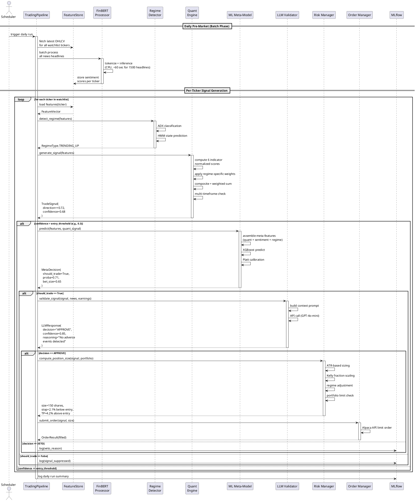

---

## 8. Directory Structure

```
trading-pipeline/
├── config/
│   ├── settings.yaml              # Global config (API keys, thresholds, paths)
│   ├── watchlist.yaml             # Ticker universe
│   ├── cluster_assignments.yaml   # {ticker: cluster_id} mapping
│   ├── promotion_log.yaml         # Audit trail: promotions, demotions, reasons
│   ├── cluster_params/            # Cluster-level defaults (baseline for all)
│   │   ├── cluster_0.yaml
│   │   ├── cluster_1.yaml
│   │   └── ...
│   └── stock_overrides/           # Individual overrides (promoted stocks only)
│       ├── AAPL.yaml
│       ├── MSFT.yaml
│       └── ...
│
├── src/
│   ├── __init__.py
│   ├── pipeline.py                # TradingPipeline orchestrator
│   │
│   ├── data/
│   │   ├── __init__.py
│   │   ├── market_data.py         # MarketDataProvider
│   │   ├── news_data.py           # NewsDataProvider
│   │   └── feature_store.py       # FeatureStore
│   │
│   ├── features/
│   │   ├── __init__.py
│   │   ├── technical.py           # Indicator computation (pandas-ta wrapper)
│   │   ├── sentiment.py           # FinBERTProcessor
│   │   └── feature_builder.py     # FeatureVector assembly
│   │
│   ├── signals/
│   │   ├── __init__.py
│   │   ├── regime.py              # RegimeDetector (HMM + ADX)
│   │   ├── quant_engine.py        # QuantEngine (composite scorer)
│   │   ├── meta_model.py          # MetaLabelModel (XGBoost meta-labeler)
│   │   └── llm_validator.py       # LLMValidator (GPT / Perplexity)
│   │
│   ├── risk/
│   │   ├── __init__.py
│   │   ├── position_sizing.py     # RiskManager
│   │   └── order_manager.py       # OrderManager (Alpaca)
│   │
│   ├── tuning/
│   │   ├── __init__.py
│   │   ├── stock_clusterer.py     # StockClusterer
│   │   ├── promotion_gate.py      # PromotionGate (hybrid tuning decision)
│   │   ├── walk_forward.py        # WalkForwardOptimizer
│   │   ├── bayesian_tuner.py      # Optuna wrapper
│   │   └── purged_cv.py           # PurgedCrossValidator
│   │
│   └── models/
│       ├── __init__.py
│       └── trade_signal.py        # TradeSignal, MetaDecision, etc.
│
├── notebooks/
│   ├── 01_data_exploration.ipynb
│   ├── 02_indicator_research.ipynb
│   ├── 03_regime_detection.ipynb
│   ├── 04_quant_signal_dev.ipynb
│   ├── 05_meta_labeling.ipynb
│   ├── 06_stock_clustering.ipynb
│   ├── 07_walk_forward_tuning.ipynb
│   ├── 08_promotion_analysis.ipynb   # Cluster vs individual comparison per stock
│   └── 09_full_backtest.ipynb
│
├── tests/
│   ├── test_quant_engine.py
│   ├── test_meta_model.py
│   ├── test_regime_detector.py
│   ├── test_risk_manager.py
│   └── test_pipeline_integration.py
│
├── scripts/
│   ├── run_daily.py               # Daily execution entry point
│   ├── run_backtest.py            # Full backtest runner
│   ├── tune_clusters.py           # Cluster + WFO tuning script
│   ├── tune_individual.py         # Individual stock WFO + promotion gate
│   ├── retrain_meta_model.py      # Monthly meta-model retraining
│   └── check_demotions.py         # Weekly demotion check for promoted stocks
│
├── data/
│   ├── raw/                       # Downloaded OHLCV, news
│   ├── features/                  # Computed feature parquets
│   ├── models/                    # Saved ML models
│   │   ├── finbert/               # Cached FinBERT model files
│   │   ├── hmm/                   # Trained HMM per cluster
│   │   ├── meta_model/            # XGBoost meta-labeler per cluster
│   │   └── clusterer/             # Fitted K-Means model
│   └── results/                   # Backtest results, logs
│
├── requirements.txt
├── pyproject.toml
└── README.md
```

---

## 9. Technology Stack

### 9.1 Core Dependencies

| Category | Library | Purpose |
|----------|---------|---------|
| **Data** | `yfinance` | Free OHLCV data |
| **Data** | `pandas`, `polars` | DataFrames |
| **Data** | `pyarrow` | Parquet read/write |
| **Indicators** | `pandas-ta` (or `pandas-ta-classic`) | 200+ technical indicators |
| **Indicators** | `ta-lib` (optional) | C-accelerated indicators for production |
| **Sentiment** | `transformers` | FinBERT model loading + inference |
| **Sentiment** | `torch` | PyTorch backend for FinBERT |
| **LLM** | `openai` | GPT-4o-mini API |
| **LLM** | `anthropic` (optional) | Claude API alternative |
| **Regime** | `hmmlearn` | Gaussian HMM for regime detection |
| **ML** | `xgboost` | Meta-labeling model |
| **ML** | `lightgbm` | Alternative / ensemble member |
| **ML** | `scikit-learn` | Pipelines, calibration, metrics |
| **Tuning** | `optuna` | Bayesian hyperparameter optimization |
| **Clustering** | `tslearn` | DTW-based time series clustering |
| **Backtesting** | `pybroker` | Walk-forward ML backtesting |
| **Backtesting** | `vectorbt` | Fast vectorized parameter sweeps |
| **Validation** | `timeseriescv` | Purged k-fold cross-validation |
| **Tracking** | `mlflow` | Experiment tracking |
| **Scheduling** | `prefect` or `apscheduler` | Pipeline scheduling |
| **Broker** | `alpaca-trade-api` | Live/paper trading |
| **Alerts** | `python-telegram-bot` | Trade notifications |
| **Phase 2** | `pykalman` / `filterpy` | Kalman filter smoothing |
| **Phase 2** | `simdkalman` | Batch Kalman for multiple stocks |
| **Phase 2** | `stable-baselines3` | RL for position sizing (DDPG/TD3) |
| **Phase 2** | `pytorch` (small model) | Attention-based feature weighting |

### 9.2 Development Phases

**Phase 1 — Research & Prototyping (Weeks 1–6):**
- Set up data pipeline with yfinance
- Implement plugin registry and abstract base classes
- Implement FinBERT batch processor (as DataEnricher plugin)
- Build quant engine with pandas-ta (each indicator as IndicatorPlugin)
- Develop regime detector (HMM + ADX)
- Research notebooks for each component
- Initial backtests with VectorBT

**Phase 2 — Meta-Labeling & Tuning (Weeks 7–12):**
- Implement triple-barrier labeling
- Train XGBoost meta-model
- Build stock clustering pipeline + hybrid promotion gate
- Implement walk-forward optimization with Optuna
- Purged CV validation
- Full pipeline backtesting with PyBroker

**Phase 3 — LLM Integration & Production (Weeks 13–18):**
- Integrate GPT-4o-mini / Perplexity validator (as SignalFilter plugin)
- Risk management module
- Alpaca paper trading integration
- Grafana monitoring dashboard
- Telegram alert service
- Paper trading validation (minimum 3 months)

**Phase 4 — Enhancements (Post-Production, Rolling):**
- Kalman filter smoothing plugin (P0 — highest impact)
- Cross-asset correlation enricher (P1)
- Fractional differentiation for ML features (P1)
- Adaptive exit management using Kalman velocity (P2)
- Options flow data enricher (P2)
- Attention-based dynamic indicator weighting (P3)
- Self-hosted LLM to eliminate API costs (P3)
- RL-based position sizing (P4 — requires 6+ months trade data)

---

## 10. Configuration Schema

```yaml
# config/settings.yaml

pipeline:
  mode: "paper"  # paper | live | backtest
  schedule: "0 7 * * 1-5"  # weekdays 7am
  watchlist_path: "config/watchlist.yaml"

data:
  market_provider: "yfinance"  # yfinance | polygon | alpaca
  news_provider: "alphavantage"
  cache_dir: "data/raw"
  feature_dir: "data/features"

sentiment:
  finbert:
    model_name: "ProsusAI/finbert"
    device: "cpu"  # cpu | cuda
    batch_size: 64
    rolling_windows: [1, 5, 20]
  llm:
    provider: "openai"  # openai | anthropic | perplexity
    model: "gpt-4o-mini"
    max_tokens: 500
    temperature: 0
    cache_ttl_hours: 24

regime:
  hmm:
    n_components: 3
    covariance_type: "full"
    n_iter: 100
    lookback_days: 504  # 2 years
  adx:
    period: 14
    trend_threshold: 25
    range_threshold: 20

quant:
  entry_confidence_threshold: 0.30
  exit_confidence_threshold: 0.20
  multi_timeframe_boost: 1.15
  default_weights:  # overridden per regime
    ma_crossover: 0.25
    rsi: 0.20
    macd: 0.20
    bollinger: 0.15
    volume: 0.10
    sentiment: 0.10

meta_model:
  algorithm: "xgboost"  # xgboost | lightgbm
  confidence_threshold: 0.55
  uncertainty_threshold: 0.15
  retrain_frequency: "monthly"
  xgboost:
    max_depth: 5
    learning_rate: 0.01
    n_estimators: 500
    reg_lambda: 7.0
    subsample: 0.8
    colsample_bytree: 0.8

tuning:
  optimizer: "optuna"
  n_trials: 100
  in_sample_days: 252
  out_of_sample_days: 126
  
  # Clustering (baseline)
  n_clusters: 5
  recluster_frequency: "quarterly"
  
  # Individual promotion gate
  promotion:
    min_history_bars: 2500           # ~10 years of daily data
    sharpe_improvement_threshold: 1.20  # individual must beat cluster × 1.20
    param_drift_threshold: 0.20      # max drift between adjacent WFO windows
    pbo_threshold: 0.40              # max Probability of Backtest Overfitting
    min_oos_trades: 30               # per OOS window for statistical significance
    demotion_lookback_days: 60       # rolling window for live performance check
    demotion_sharpe_gap: 0.30        # demote if individual trails cluster by > 0.30

risk:
  max_position_pct: 0.05       # max 5% of portfolio per position
  max_sector_pct: 0.20         # max 20% in one sector
  kelly_fraction: 0.5          # half-Kelly
  atr_stop_multiplier: 2.0
  atr_tp_multiplier: 4.0
  max_daily_drawdown_pct: 0.05
  max_total_drawdown_pct: 0.15
  regime_size_adjustments:
    TRENDING_UP: 1.0
    TRENDING_DOWN: 0.8
    RANGING: 0.8
    VOLATILE: 0.5

broker:
  provider: "alpaca"
  api_key_env: "ALPACA_API_KEY"
  secret_key_env: "ALPACA_SECRET_KEY"
  base_url: "https://paper-api.alpaca.markets"  # paper trading

alerts:
  telegram:
    bot_token_env: "TELEGRAM_BOT_TOKEN"
    chat_id_env: "TELEGRAM_CHAT_ID"
  on_trade: true
  on_veto: true
  on_drawdown_breach: true
```

---

## 11. Key Design Decisions & Rationale

| Decision | Choice | Rationale |
|----------|--------|-----------|
| Cascade vs. Ensemble | Always-on meta-labeling cascade | Quant provides high-recall direction; ML meta-model filters false positives (precision). Theoretically grounded in López de Prado's framework. Better Sharpe than pure ensemble due to reduced false positive trades. |
| Sentiment layer position | FinBERT pre-quant (free batch), GPT post-signal (paid, conditional) | FinBERT as a feature costs nothing and enriches both quant and ML layers. Expensive LLM calls only fire for actionable signals (~5-15% of universe daily). 90%+ API cost reduction vs. running GPT on all tickers. |
| Per-stock tuning approach | Hybrid: cluster baseline + individual promotion | Clustering pools data across behaviorally similar stocks, providing 5–10× more training data and reducing overfitting risk. Stocks with deep history (10+ years) that demonstrate significant, stable OOS improvement over cluster defaults are promoted to individual parameters. Automatic demotion on degradation prevents stale overrides. Expected split: ~25% individual, ~75% cluster. |
| ML model for meta-labeling | XGBoost with Platt calibration | Tabular financial features suit gradient-boosted trees. Well-calibrated probabilities enable confidence-based position sizing. Interpretable feature importance aids debugging. |
| Validation methodology | Purged k-fold + Walk-forward | Standard k-fold leaks future information in financial time series. Purging removes label-overlapping observations; embargo gap prevents serial correlation leakage. WFO simulates real deployment. |
| Regime detection | HMM + ADX dual approach | ADX provides instant, interpretable regime classification. HMM provides probabilistic state estimation with transition dynamics. Combining both gives robust regime signals with fast fallback. |
| Extensibility | Plugin architecture with abstract interfaces | Four plugin types (IndicatorPlugin, SmoothingPlugin, DataEnricher, SignalFilter) allow adding Kalman filters, fractional differentiation, attention mechanisms, RL sizing, or any future enhancement without modifying core pipeline code. Config-driven activation means zero code changes to toggle plugins on/off. |

---

## 12. Anti-Overfitting Checklist

Before deploying any parameter set or model to production, verify:

- [ ] All features use only past data (`shift(1)` applied, no centered windows)
- [ ] Labels don't incorporate future prices beyond the defined horizon
- [ ] Walk-forward analysis spans at least 4 complete OOS windows
- [ ] Optimal parameters are stable across adjacent WFO windows (< 20% drift)
- [ ] Purged k-fold CV with appropriate embargo gap applied
- [ ] Combinatorial Purged CV Probability of Backtest Overfitting < 0.50
- [ ] Delisted securities included in backtest (survivorship bias check)
- [ ] Corporate actions (splits, dividends) adjusted in OHLCV data
- [ ] Transaction costs (commissions + slippage) included in backtest
- [ ] Bonferroni correction applied when testing multiple parameter sets
- [ ] OOS Sharpe ratio ≥ 0.5 (minimum for position trading)
- [ ] Maximum drawdown < 25% across all OOS windows
- [ ] At least 30 trades per OOS window for statistical significance
- [ ] Paper trading minimum 3 months before live capital deployment

---

## 13. Plugin Architecture for Extensibility

The system is designed with a plugin-based architecture so that enhancements like Kalman filtering, fractional differentiation, or reinforcement learning can be added without modifying core pipeline code. Each pipeline stage communicates through standardized contracts, and new components register themselves through a discovery mechanism.

### 13.1 Core Abstractions

Every pluggable component implements one of four abstract interfaces. The pipeline orchestrator discovers and loads plugins at startup based on configuration, not hardcoded imports.

```plantuml
@startuml
skinparam backgroundColor white
skinparam classAttributeIconSize 0

package "Plugin Interfaces (Abstract Base Classes)" {

    abstract class IndicatorPlugin {
        +name: str
        +category: str  // "trend" | "momentum" | "volatility" | "volume" | "filter"
        +version: str
        +{abstract} compute(df: pd.DataFrame, params: Dict) : pd.DataFrame
        +{abstract} normalize(values: pd.Series) : pd.Series
        +{abstract} get_tunable_params() : Dict[str, ParamSpec]
        +{abstract} get_default_params() : Dict[str, Any]
    }

    abstract class SignalFilter {
        +name: str
        +stage: str  // "pre_quant" | "post_quant" | "post_meta"
        +{abstract} filter(signal: TradeSignal, context: Dict) : TradeSignal
        +{abstract} should_activate(context: Dict) : bool
    }

    abstract class SmoothingPlugin {
        +name: str
        +{abstract} smooth(series: pd.Series, params: Dict) : SmoothResult
        +{abstract} get_tunable_params() : Dict[str, ParamSpec]
    }

    abstract class DataEnricher {
        +name: str
        +data_type: str  // "sentiment" | "macro" | "alternative" | "cross_asset"
        +{abstract} enrich(ticker: str, features: FeatureVector) : Dict[str, float]
        +{abstract} batch_enrich(tickers: List[str]) : Dict[str, Dict]
    }

    class SmoothResult {
        +smoothed: pd.Series
        +trend: pd.Series
        +velocity: pd.Series
        +noise_estimate: pd.Series
        +confidence: pd.Series
    }

    class ParamSpec {
        +name: str
        +type: str  // "int" | "float" | "categorical"
        +low: float
        +high: float
        +default: Any
        +description: str
    }
}

package "Plugin Registry" {
    class PluginRegistry {
        -_indicators: Dict[str, IndicatorPlugin]
        -_filters: Dict[str, SignalFilter]
        -_smoothers: Dict[str, SmoothingPlugin]
        -_enrichers: Dict[str, DataEnricher]
        +register(plugin: Any) : void
        +get_indicator(name: str) : IndicatorPlugin
        +get_filter(name: str) : SignalFilter
        +get_smoother(name: str) : SmoothingPlugin
        +get_enricher(name: str) : DataEnricher
        +discover_plugins(path: str) : void
        +list_available() : Dict[str, List[str]]
    }
}

package "Built-in Plugins (Phase 1)" {
    class SMAIndicator extends IndicatorPlugin {
        +compute(df, params): pd.DataFrame
        +normalize(values): pd.Series
    }
    class RSIIndicator extends IndicatorPlugin
    class MACDIndicator extends IndicatorPlugin
    class BollingerIndicator extends IndicatorPlugin
    class DonchianIndicator extends IndicatorPlugin
    class VolumeIndicator extends IndicatorPlugin
    class FinBERTEnricher extends DataEnricher
}

package "Phase 2 Plugins (Future)" #lightyellow {
    class KalmanSmoother extends SmoothingPlugin
    class FracDiffTransformer extends IndicatorPlugin
    class AttentionWeighter extends SignalFilter
    class OptionsFlowEnricher extends DataEnricher
    class CrossAssetEnricher extends DataEnricher
}

PluginRegistry --> IndicatorPlugin
PluginRegistry --> SignalFilter
PluginRegistry --> SmoothingPlugin
PluginRegistry --> DataEnricher

@enduml
```

### 13.2 Plugin Registration and Discovery

Plugins are discovered at startup via Python entry points or a directory scan. The config file controls which plugins are active.

```yaml
# config/plugins.yaml

indicators:
  enabled:
    - name: "sma_crossover"
      class: "src.plugins.indicators.SMAIndicator"
      active: true
    - name: "rsi"
      class: "src.plugins.indicators.RSIIndicator"
      active: true
    - name: "macd"
      class: "src.plugins.indicators.MACDIndicator"
      active: true
    - name: "bollinger"
      class: "src.plugins.indicators.BollingerIndicator"
      active: true
    - name: "donchian"
      class: "src.plugins.indicators.DonchianIndicator"
      active: true
    - name: "volume"
      class: "src.plugins.indicators.VolumeIndicator"
      active: true
    # Phase 2 — uncomment to activate
    # - name: "kalman_trend"
    #   class: "src.plugins.smoothing.KalmanSmoother"
    #   active: true
    # - name: "frac_diff"
    #   class: "src.plugins.indicators.FracDiffTransformer"
    #   active: true

smoothers:
  enabled: []
  # Phase 2 — Kalman smoother applied to price before indicator calculation
  # - name: "kalman"
  #   class: "src.plugins.smoothing.KalmanSmoother"
  #   apply_to: ["close", "volume"]  # which series to smooth
  #   active: true

enrichers:
  enabled:
    - name: "finbert"
      class: "src.plugins.enrichers.FinBERTEnricher"
      active: true
    # Phase 2
    # - name: "options_flow"
    #   class: "src.plugins.enrichers.OptionsFlowEnricher"
    #   active: true
    # - name: "cross_asset"
    #   class: "src.plugins.enrichers.CrossAssetEnricher"
    #   active: true

filters:
  enabled: []
  # Phase 2 — attention-based dynamic weighting
  # - name: "attention_weighter"
  #   class: "src.plugins.filters.AttentionWeighter"
  #   stage: "post_quant"
  #   active: true
```

### 13.3 How the Quant Engine Uses Plugins

The `QuantEngine` no longer hardcodes indicators. It iterates over registered `IndicatorPlugin` instances, calls `compute()` and `normalize()` on each, and applies regime-weighted combination. Adding a new indicator is zero-change to the engine — just register the plugin and assign it a weight in the regime config.

```python
# Simplified pseudocode — QuantEngine with plugin support
class QuantEngine:
    def __init__(self, registry: PluginRegistry, config: Dict):
        self.indicators = [
            registry.get_indicator(name) 
            for name in config["indicators"]["enabled"]
        ]
        self.smoothers = [
            registry.get_smoother(name)
            for name in config.get("smoothers", {}).get("enabled", [])
        ]
    
    def generate_signal(self, features: FeatureVector) -> TradeSignal:
        df = features.to_dataframe()
        
        # Step 1: Apply smoothers (e.g., Kalman) to raw price data
        for smoother in self.smoothers:
            result = smoother.smooth(df["close"], smoother.params)
            df["smoothed_close"] = result.smoothed
            df["trend_velocity"] = result.velocity
            df["noise_estimate"] = result.noise_estimate
        
        # Step 2: Compute all registered indicators
        scores = {}
        for indicator in self.indicators:
            computed = indicator.compute(df, indicator.params)
            normalized = indicator.normalize(computed)
            scores[indicator.name] = normalized
        
        # Step 3: Regime-weighted composite (unchanged logic)
        regime = features.regime
        weights = self.regime_weights[regime]
        composite = sum(
            scores[name] * weights.get(name, 0) 
            for name in scores
        )
        
        return TradeSignal(direction=composite, confidence=abs(composite), ...)
```

### 13.4 Updated Directory Structure for Plugins

```
src/
├── plugins/
│   ├── __init__.py
│   ├── registry.py              # PluginRegistry
│   ├── base.py                  # Abstract base classes (IndicatorPlugin, etc.)
│   │
│   ├── indicators/              # IndicatorPlugin implementations
│   │   ├── __init__.py
│   │   ├── sma.py               # Phase 1: SMA crossover
│   │   ├── rsi.py               # Phase 1: RSI
│   │   ├── macd.py              # Phase 1: MACD
│   │   ├── bollinger.py         # Phase 1: Bollinger Bands
│   │   ├── donchian.py          # Phase 1: Donchian Channel
│   │   ├── volume.py            # Phase 1: Volume analysis
│   │   └── frac_diff.py         # Phase 2: Fractional differentiation
│   │
│   ├── smoothing/               # SmoothingPlugin implementations
│   │   ├── __init__.py
│   │   ├── kalman.py            # Phase 2: Kalman filter
│   │   └── ukf.py               # Phase 2: Unscented Kalman filter
│   │
│   ├── enrichers/               # DataEnricher implementations
│   │   ├── __init__.py
│   │   ├── finbert.py           # Phase 1: FinBERT sentiment
│   │   ├── options_flow.py      # Phase 2: Options unusual activity
│   │   └── cross_asset.py       # Phase 2: Sector/market correlation
│   │
│   └── filters/                 # SignalFilter implementations
│       ├── __init__.py
│       ├── attention.py         # Phase 2: Attention-based weighting
│       └── rl_sizer.py          # Phase 2: RL-based position sizing
```

---

## 14. Phase 2 — Future Enhancements Roadmap

The following enhancements are designed as drop-in plugins that integrate with the Phase 1 architecture through the plugin interfaces defined above. Each enhancement is independent — they can be implemented in any order and activated individually.

### 14.1 Kalman Filter Smoothing

**Plugin type:** `SmoothingPlugin`
**Impact:** Reduces false crossover signals, provides adaptive noise estimation, eliminates MA period as a tunable parameter.

**What it does:** Replaces or augments fixed-period moving averages with a state-space model that dynamically adjusts smoothing based on observed signal-to-noise ratio. The state vector is `[price, velocity]`, where velocity represents the trend rate of change. The Kalman gain automatically increases responsiveness during clear trends and increases smoothing during noisy/ranging periods.

**Three integration points:**

| Integration Point | How It Works | Benefit |
|---|---|---|
| **Adaptive trend line** | Kalman-smoothed price replaces SMA/EMA in crossover signals | Fewer whipsaws; no MA period to tune (self-adapting) |
| **Regime detection input** | Feed Kalman-smoothed returns + noise estimate to HMM | Cleaner regime assignments, less regime flickering |
| **Dynamic indicator weights** | Treat indicator weights as hidden state, trade outcomes as observations | Weights auto-adapt per stock without monthly WFO re-tuning |

**Output features added to FeatureVector:**

```python
# New features from KalmanSmoother plugin
"kalman_smoothed_price"    # adaptive trend line
"kalman_velocity"          # rate of price change (trend strength + direction)
"kalman_acceleration"      # second derivative — trend change detection
"kalman_noise_estimate"    # real-time signal-to-noise ratio
"kalman_residual"          # deviation of price from smoothed (mean-reversion signal)
"kalman_confidence"        # inverse of estimation uncertainty
```

**Libraries:** `pykalman` (simple), `filterpy` (full-featured, includes UKF), `simdkalman` (batch-optimized for multiple stocks)

**Implementation sketch:**

```python
class KalmanSmoother(SmoothingPlugin):
    name = "kalman"
    
    def smooth(self, series: pd.Series, params: Dict) -> SmoothResult:
        kf = KalmanFilter(
            transition_matrices=[[1, 1], [0, 1]],   # [price, velocity]
            observation_matrices=[[1, 0]],
            initial_state_mean=[series.iloc[0], 0],
            initial_state_covariance=np.eye(2),
            observation_covariance=params.get("obs_noise", 1.0),
            transition_covariance=np.eye(2) * params.get("process_noise", 0.01)
        )
        state_means, state_covs = kf.filter(series.values)
        
        return SmoothResult(
            smoothed=pd.Series(state_means[:, 0], index=series.index),
            trend=pd.Series(state_means[:, 0], index=series.index),
            velocity=pd.Series(state_means[:, 1], index=series.index),
            noise_estimate=pd.Series(np.sqrt(state_covs[:, 0, 0]), index=series.index),
            confidence=pd.Series(1.0 / np.sqrt(state_covs[:, 0, 0]), index=series.index),
        )
    
    def get_tunable_params(self) -> Dict[str, ParamSpec]:
        return {
            "obs_noise": ParamSpec("obs_noise", "float", 0.1, 10.0, 1.0,
                                  "Measurement noise — higher = more smoothing"),
            "process_noise": ParamSpec("process_noise", "float", 0.001, 1.0, 0.01,
                                      "Process noise — higher = more responsive to changes"),
        }
```

### 14.2 Fractional Differentiation

**Plugin type:** `IndicatorPlugin` (pre-processor)
**Impact:** Makes price series stationary for ML while preserving long-term memory that standard differencing destroys.

**The problem:** Raw prices are non-stationary (ML models struggle). Standard first-differencing (`returns = price.pct_change()`) achieves stationarity but destroys all memory of price levels — a stock at $500 looks the same as one at $50 in return space. López de Prado's fractional differentiation applies a fractional order `d` (typically 0.3–0.5) that balances stationarity with memory preservation.

**How it integrates:** The `FracDiffTransformer` plugin pre-processes the close price series before it enters the ML meta-model's feature set. The quant engine continues to use raw prices (moving averages, RSI, etc. need raw prices), but the meta-model receives fractionally differentiated features that are both stationary and memory-preserving.

```python
class FracDiffTransformer(IndicatorPlugin):
    name = "frac_diff"
    category = "filter"
    
    def compute(self, df: pd.DataFrame, params: Dict) -> pd.DataFrame:
        d = params.get("d", 0.4)
        threshold = params.get("weight_threshold", 1e-4)
        # Fixed-width window fractional differentiation (AFML Chapter 5)
        weights = _get_weights_ffd(d, threshold)
        df["frac_diff_close"] = _frac_diff(df["close"], weights)
        return df
```

**Libraries:** `mlfinlab` (has `frac_diff_ffd` built in), or implement from AFML Chapter 5 (~30 lines of code)

### 14.3 Attention-Based Dynamic Feature Weighting

**Plugin type:** `SignalFilter` (stage: `post_quant`)
**Impact:** Replaces static regime-dependent indicator weights with a learned attention mechanism that dynamically weights indicators based on current market state.

**The problem:** The Phase 1 quant engine uses a fixed weight table per regime (e.g., trending: MA=0.35, MACD=0.30...). These weights are static within each regime, but in reality the optimal weighting shifts continuously. An attention mechanism learns which indicators are most informative right now, for this specific stock, at this moment.

**Architecture:** A small neural network (2 layers, ~1K parameters) takes as input the current values of all normalized indicator scores plus regime features, and outputs a softmax weight vector over those indicators. Trained on historical data where the label is whether the composite signal led to a profitable trade.

```python
class AttentionWeighter(SignalFilter):
    name = "attention_weighter"
    stage = "post_quant"
    
    def filter(self, signal: TradeSignal, context: Dict) -> TradeSignal:
        indicator_scores = context["indicator_scores"]  # Dict[str, float]
        regime_features = context["regime_features"]     # one-hot encoded
        
        # Concatenate into input vector
        x = np.array(list(indicator_scores.values()) + regime_features)
        
        # Forward pass through attention network
        weights = self.attention_net.predict(x)  # softmax output
        
        # Re-compute composite with learned weights
        new_composite = sum(
            score * weight 
            for score, weight in zip(indicator_scores.values(), weights)
        )
        signal.direction = np.clip(new_composite, -1, 1)
        signal.confidence = abs(new_composite)
        return signal
```

**Libraries:** `torch` (tiny model, trains in seconds), or even `scikit-learn` MLPClassifier

### 14.4 Cross-Asset Correlation Features

**Plugin type:** `DataEnricher`
**Impact:** Captures sector rotation, market breadth, and inter-market signals that single-stock analysis misses.

**Features to add:**

```python
# Cross-asset features from CrossAssetEnricher plugin
"sector_relative_strength"   # stock return vs. sector ETF return
"sp500_correlation_20d"      # rolling correlation to S&P 500
"vix_level"                  # absolute VIX (fear gauge)
"vix_term_structure"         # VIX contango/backwardation
"yield_curve_slope"          # 10Y-2Y treasury spread
"usd_index_momentum"        # DXY rate of change
"sector_breadth"             # % of sector stocks above 50-day SMA
"market_breadth"             # advance-decline ratio
```

**Why it matters:** Position trading signals are significantly affected by macro conditions that single-stock analysis misses entirely. A bullish RSI divergence on AAPL during a market-wide selloff has very different expected outcomes than the same signal during a broad rally. These features enrich both the quant composite (as additional input signals) and the meta-model (as context for evaluating signal quality).

**Data sources:** yfinance (sector ETFs: XLK, XLF, etc.), FRED API (yield curve, USD index), VIX futures term structure from CBOE.

### 14.5 Options Flow Signals

**Plugin type:** `DataEnricher`
**Impact:** Detects unusual institutional positioning that often precedes large price moves.

**Features:**

```python
"put_call_ratio"             # total puts / total calls
"put_call_ratio_change"      # rate of change in P/C ratio
"implied_vol_skew"           # OTM put IV vs OTM call IV
"unusual_options_activity"   # volume > 3× open interest on any strike
"max_pain_distance"          # current price vs. options max pain level
"iv_rank_percentile"         # current IV vs. 52-week IV range
```

**Data sources:** CBOE, Polygon.io options feed, or free tier from Unusual Whales API / Barchart.

### 14.6 Reinforcement Learning Position Sizer

**Plugin type:** `SignalFilter` (stage: `post_meta`)
**Impact:** Replaces the static Kelly/ATR position sizing with a learned policy that optimizes position sizes based on accumulated experience.

**Architecture:** A DDPG (Deep Deterministic Policy Gradient) agent where the state is `[signal_confidence, regime, current_drawdown, portfolio_heat, volatility_estimate, ...]`, the action is a continuous position size in `[0, max_position]`, and the reward is risk-adjusted P&L (Sharpe of the trade sequence). The agent learns to size positions larger when conditions favor success and smaller during uncertain periods — going beyond what static formulas can capture.

**Why Phase 2:** RL requires substantial data to train safely, and a wrong sizing policy is directly destructive to capital. Train on extensive backtested signal data from Phase 1 before deploying.

**Libraries:** `stable-baselines3` (DDPG, TD3), `finrl` (finance-specific RL)

### 14.7 Adaptive Exit Management

**Plugin type:** `SignalFilter` (stage: `post_meta`)
**Impact:** Replaces fixed ATR-multiplier stop-loss and take-profit with dynamic exits that adapt to current volatility regime and trade progress.

**Mechanisms:**

| Exit Type | Phase 1 (Static) | Phase 2 (Adaptive) |
|-----------|-------------------|---------------------|
| Stop-loss | Fixed ATR × 2.0 | Chandelier stop: trailing ATR stop that tightens as trade moves in favor |
| Take-profit | Fixed ATR × 4.0 | Partial exits at 1R, 2R, 3R profit targets (scale out, not all-or-nothing) |
| Time stop | Fixed N days | Regime-aware: exit faster in volatile regime, hold longer in trending |
| Trailing stop | None | Kalman velocity-based: tighten when trend velocity decelerates |

The Kalman filter's velocity estimate (from enhancement 14.1) feeds directly into the trailing stop logic — when velocity decelerates toward zero, the trailing stop tightens, capturing profits before a reversal.

### 14.8 Self-Hosted LLM (Cost Elimination)

**Plugin type:** `DataEnricher` (replaces GPT API calls)
**Impact:** Eliminates all LLM API costs by running FinGPT or a quantized Llama model locally.

**Requirements:** GPU with 8+ GB VRAM for a 7B parameter model (quantized to 4-bit via GPTQ or GGUF). RTX 3060 or better. Processes a full earnings transcript analysis in ~10 seconds.

**Implementation:** Replace `LLMValidator`'s API call with a local inference call to `llama-cpp-python` or `vllm` serving a FinGPT-tuned model. The interface remains identical — the plugin system means swapping `OpenAIValidator` for `LocalLLMValidator` is a config change.

### 14.9 Enhancement Dependency Map

Some enhancements build on others. This map shows the recommended implementation order within Phase 2.

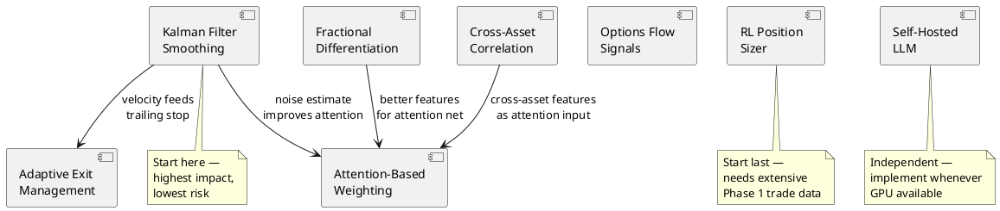

**Recommended Phase 2 implementation order:**

| Priority | Enhancement | Depends On | Effort | Impact |
|----------|-------------|------------|--------|--------|
| P0 | Kalman Filter Smoothing | None | 1-2 weeks | High — reduces false signals, enables adaptive exits |
| P1 | Cross-Asset Correlation | None | 1 week | Medium — captures macro context missing from single-stock analysis |
| P1 | Fractional Differentiation | None | 2-3 days | Medium — improves ML meta-model feature quality |
| P2 | Adaptive Exit Management | Kalman Filter | 1-2 weeks | High — dynamic exits directly impact P&L |
| P2 | Options Flow Signals | None | 1-2 weeks | Medium — institutional signal (data access dependent) |
| P3 | Attention-Based Weighting | Kalman + FracDiff (recommended) | 2-3 weeks | Medium-High — replaces static regime weights |
| P3 | Self-Hosted LLM | None | 1 week | Medium — eliminates API costs (GPU required) |
| P4 | RL Position Sizer | 6+ months Phase 1 trade data | 3-4 weeks | High — but requires extensive training data to be safe |

---

## 15. References

### Books
- López de Prado, M. (2018). *Advances in Financial Machine Learning*. Wiley.
- Jansen, S. (2020). *Machine Learning for Algorithmic Trading*, 2nd Edition.
- Carver, R. (2015). *Systematic Trading*. Harriman House.

### Papers
- Lopez-Lira, A. & Tang, Y. (2023). "Can ChatGPT Forecast Stock Price Movements?" arXiv:2304.07619.
- Fatouros, G. et al. (2024). "MarketSenseAI." Springer Neural Computing and Applications.
- "End-to-End LLM Enhanced Trading System." arXiv:2502.01574.
- Kalman, R. E. (1960). "A New Approach to Linear Filtering and Prediction Problems." ASME.
- Wan, E. A. & van der Merwe, R. (2004). "The Unscented Kalman Filter for Nonlinear Estimation."

### Open-Source Projects
- PyBroker — github.com/edtechre/pybroker
- FinGPT — github.com/AI4Finance-Foundation/FinGPT
- Microsoft Qlib — github.com/microsoft/qlib
- VectorBT — github.com/polakowo/vectorbt
- mlfinlab — github.com/hudson-and-thames/mlfinlab
- filterpy — github.com/rlabbe/filterpy (Kalman filter library)
- pykalman — github.com/pykalman/pykalman (simple Kalman filter)
- stable-baselines3 — github.com/DLR-RM/stable-baselines3 (RL for position sizing)
